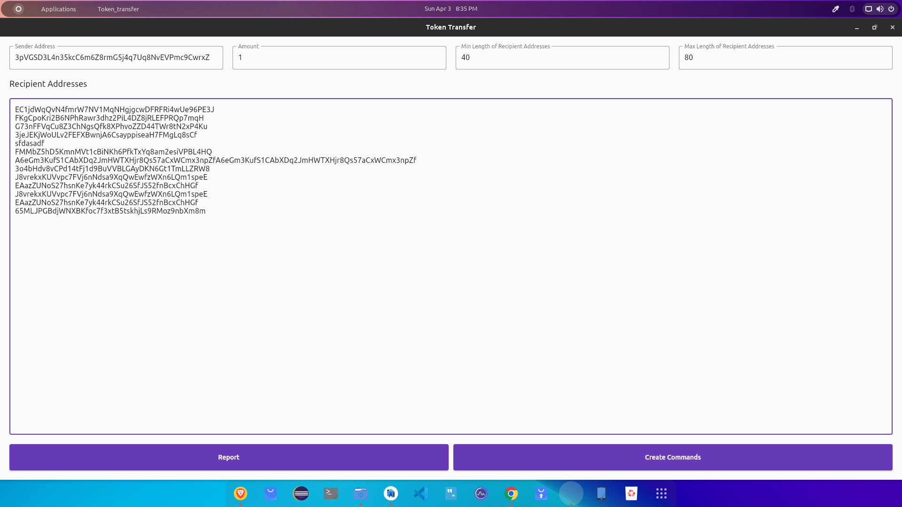
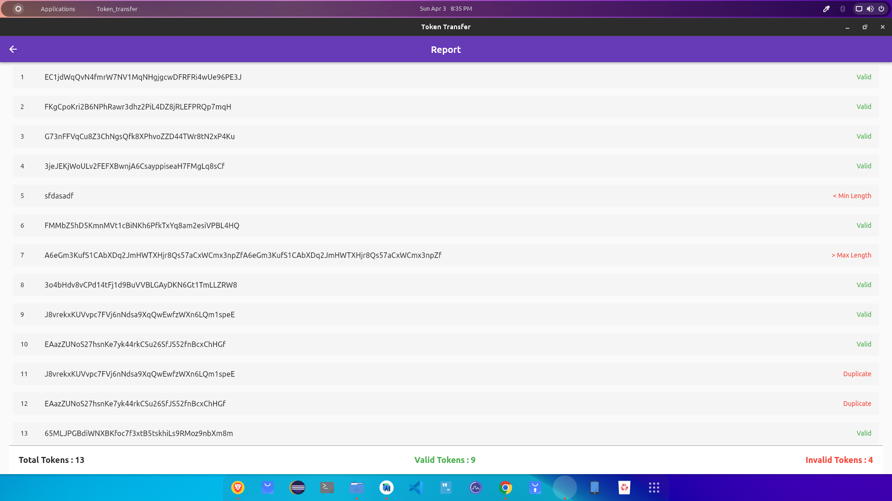
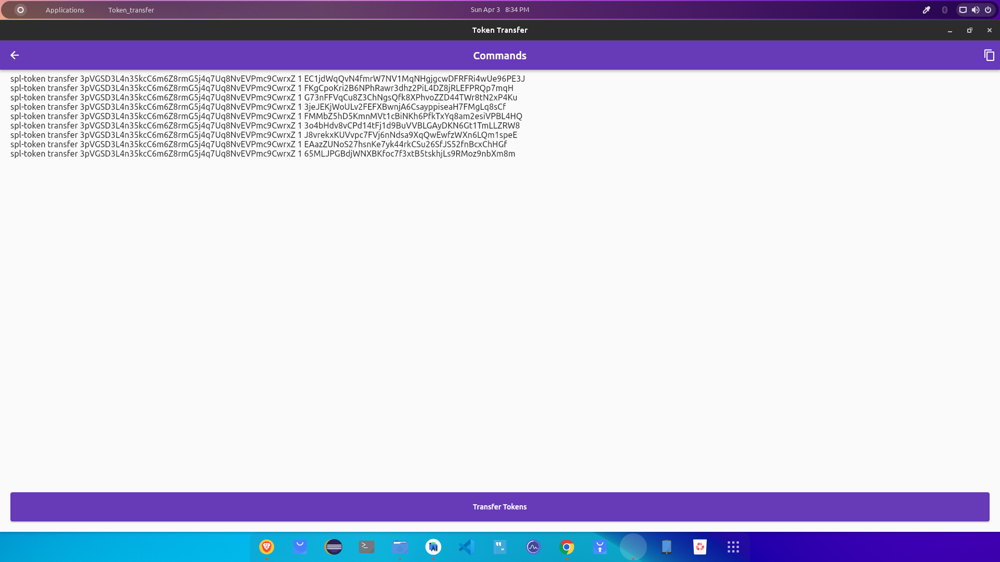
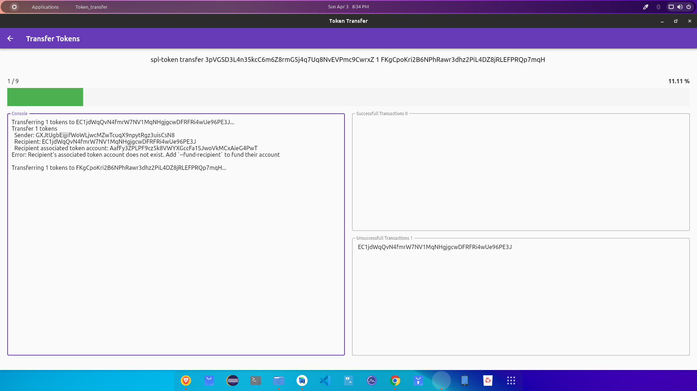

#Solana Bulk Token Transfer

<h3 style="font-size: 18px; letter-spacing: 1.2px">ABOUT APP</h3>

    
This app will transfer solana tokens to users. You don't have to transfer the tokens manually now on. The app will also remove duplicate entries and invalid addresses. You can also copy all commands and run on your machine

<h3 style="font-size: 18px; letter-spacing: 1.2px">FEATURES</h3>
<ol style="font-size: 16px;color: rgb(124, 122, 122);letter-spacing: 0.8px;line-height: 1.5;">
    <li>Bulk Solana Token Transfer</li>   
    <li>Remove dupliate Entries From Addresses</li>   
    <li>Remove invalid addresses</li>   
    <li>Create list of successfull and unsuccessfull transactions</li>
</ol>

<h3 style="font-size: 18px; letter-spacing: 1.2px">SCREEN SHOTS</h3>

  
  
  
  

<h3 style="font-size: 18px; letter-spacing: 1.2px">CREATED BY</h3>

[Ajaysinh Rathod](https://github.com/Ajaysinh1290)

Email : ajaysinhrathod1290@gmail.com